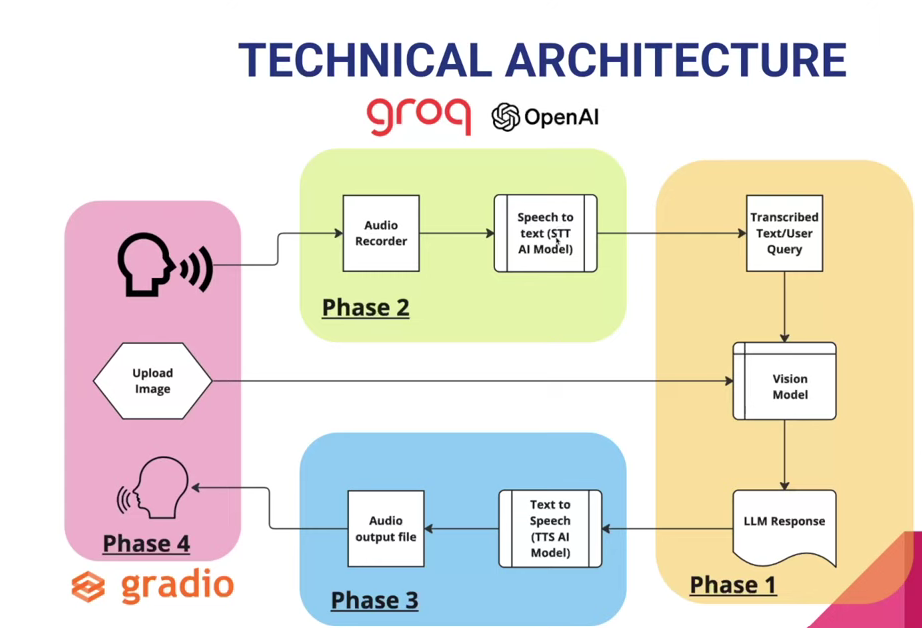

# 🧠 MediGuru

MediGuru is an advanced web-based AI healthcare assistant that empowers users to speak their symptoms, upload medical images (like X-rays), and even analyze prescriptions—all through a simple, intuitive interface. Leveraging state-of-the-art speech-to-text, vision, and language models, MediGuru delivers:

- **Professional, voice-based medical advice** tailored to your symptoms and images
- **Prescription analysis** for uploaded prescriptions or medication lists
- **Multi-modal AI** that combines voice, text, and image understanding for holistic responses
- **Natural, conversational interactions** that feel like talking to a real doctor
- **Instant audio feedback** so you can listen to the AI doctor's response

Whether you need a quick check on your symptoms, a second opinion on a scan, or help understanding a prescription, MediGuru brings the power of modern AI to your healthcare journey—all from your browser.

---

## 🖼️ Technical Architecture



*Place the image file as `technical_architecture.png` in the project root or update the path as needed.*

---

## 🚀 Tech Stack
- **Python 3.10+**
- **Gradio** (web UI)
- **gTTS** (Google Text-to-Speech)
- **Groq API** (for transcription and LLM-based image analysis)
- **pydub, scipy** (audio processing)
- **dotenv** (environment variable management)
- **Render** (cloud deployment)

---

## ✨ Features
- **Voice Input:** Speak your symptoms directly in the browser.
- **Image Upload:** Upload medical images (e.g., X-rays, scans).
- **AI Diagnosis:** Uses LLMs to analyze your symptoms and images, returning a concise, human-like doctor's response.
- **Voice Output:** Doctor's response is read aloud using gTTS.
- **Web-based:** No installation required for end users—just open the app in your browser.

---

## 🛠️ Setup & Local Development

1. **Clone the repository:**
   ```bash
   git clone <your-repo-url>
   cd MediGuru
   ```

2. **Create a virtual environment (recommended):**
   ```bash
   python -m venv venv
   source venv/bin/activate  # On Windows: venv\Scripts\activate
   ```

3. **Install dependencies:**
   ```bash
   pip install -r requirements.txt
   ```

4. **Set up environment variables:**
   - Create a `.env` file in the project root:
     ```env
     GROQ_API_KEY=your_groq_api_key_here
     ```

5. **Run the app locally:**
   ```bash
   python gradio_app.py
   ```
   - The app will be available at `http://localhost:7860` by default.

---

## ☁️ Deployment (Render)

1. **Push your code to GitHub.**
2. **Create a new Web Service on [Render](https://render.com/):**
   - Connect your GitHub repo.
   - Set the build command: `pip install -r requirements.txt`
   - Set the start command: `python gradio_app.py`
   - Add the environment variable `GROQ_API_KEY` in the Render dashboard.
3. **Wait for deployment.**
4. **Access your app via the public Render URL!**

---

## 📝 Usage
- **Speak** your symptoms using the microphone input.
- **Upload** a medical image (optional).
- **Receive** a doctor's response in both text and voice.

---

## 📁 Project Structure
```
MediGuru/
├── brain_of_the_doctor.py         # Image encoding & LLM analysis
├── gradio_app.py                 # Main Gradio web app
├── requirements.txt              # Python dependencies
├── render.yaml                   # Render deployment config
├── voice_of_the_doctor.py        # Text-to-speech (gTTS)
├── voice_of_the_patient.py       # Audio transcription (Groq)
└── ...
```

---

## 👤 Author
**Subhranil Mondal**

---

## 📜 License
This project is licensed under the [GNU GPL v3](LICENSE). 